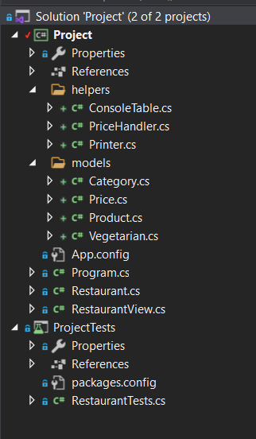
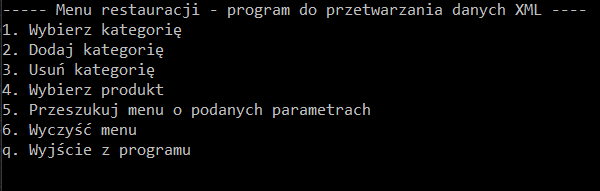
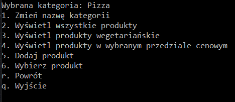
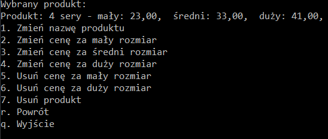
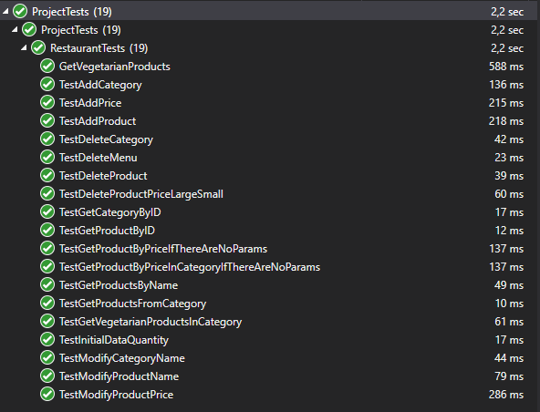

# Przetwarzanie dokumentów XML - Program do zarządzania menu restauracji

## Marta Dychała
----------------------

  - [1. Cel projektu](#1-cel-projektu)
  - [2. Instalacja projektu](#2-instalacja-projektu)
  - [3. Wykorzystane technologie](#3-wykorzystane-technologie)
  - [4. Struktura projektu](#4-struktura-projektu)
    - [4.1. Baza danych](#41-baza-danych)
    - [4.2. API](#42-api)
  - [5. Funkcjonalności udostępnione przez API](#5-funkcjonalności-udostępnione-przez-api)
    - [5.1 Metody przeszukujące](#51-metody-przeszukujące)
    - [5.2 Metody wstawiające węzły](#52-metody-wstawiające-węzły)
    - [5.3 Metody modyfikujące węzły lub atrybuty](#53-metody-modyfikujące-węzły-lub-atrybuty)
    - [5.4 Metody usuwające węzły](#54-metody-usuwające-węzły)
  - [6. Implementacja API](#6-implementacja-api)
  - [7. Testy jednostkowe](#7-testy-jednostkowe)
  - [8. Podsumowanie](#8-podsumowanie)
  - [9. Źródła](#9-źródła)

## 1. Cel projektu

Tematem projektu jest program, który ułatwia zarządzanie menu restauracji. Menu to zapisywane jest w postaci dokumentu XML. Zarządzając menu, dokonuje się modyfikacji na dokumentach XML znajdujących się w bazie danych.

## 2. Instalacja projektu

Przed uruchomieniem projektu należy wykonać pliki sql znajdujące się we folderze __sql__ zgodnie z kolejnością wyznaczoną przez nazwy plików (oprócz plików rozpoczynających się od 6 i 7, służących do czyszczenia bazy danych). Spowoduje to utworzenie bazy danych, schematu XSD, tabeli oraz procedur wywołujących zgrupowane polecenia.

Po wykonaniu poleceń z plików sql, należy w pliku Restaurant.cs zamienić Data Source w poniższej linii:

```cs
string connStr = @"Data Source=******;Initial Catalog = Project;Integrated Security = True;";
```

na nazwę lokalnego serwera.

## 3. Wykorzystane technologie

Program został napisany w języku C# po stronie aplikacji konsolowej, zaś do zarządzania bazą danych wykorzystano Microsoft SQL Server. Jako interfejs będący pośrednikiem między bazą danych a API wykorzystano ADO.NET.

Do napisania programu wykorzystano program Visual Studio 2019 w części projektu wykorzystującej C# oraz Microsoft SQL Server Management Studio 18 po stronie bazy danych.

W projekcie zostal użyty Microsoft .NET Framework w wersji 4.7.2.

## 4. Struktura projektu

### 4.1. Baza danych

Baza danych projektu `Project` składa się z jednej tabeli - `ProjectXML`. Tabela ta posiada tylko jeden rekord i jedną kolumnę (`menuXML`), w którym znajduje się XML zawierający menu restauracji.

Wszelkie operacje wykonywane za pomocą API, modyfikują jedyny XML znajdujący się w tabeli `ProjectXML`.

Do poprawnego działania API wymagane jest dodanie rekordu do bazy danych posiadającego strukturę opisaną poniżej:

- Węzłem najwyżej w hierarchii jest `<Menu />`,
- `<Category />` są kategoriami w omawianym menu - tworzą poddokumenty składające się z węzłów `<Product />`. To co odróżnia każdą kategorię, to atrybuty:

  - `id` - id kategorii
  - `name` - nazwa kategorii

- `<Product />` to węzły produktów, które posiadają nazwę (węzeł `<Name />`) oraz cenę, bądź ceny (węzeł `<Prices />` posiadający węzły `<Price />`). Ponadto jako atrybut, każdy produkt posiada `id` oraz może posiadać informację, czy jest wegetariański (atrybut `vegetarian`)
- `<Price>` - cena za rozmiar danego produktu, który określany jest przez atrybut `type`. Atrybut ten może posiadać jedynie trzy wartości:
  
  - _medium_ - cena za zwykły rozmiar - węzeł `<Prices />` musi posiadać potomka `<Price />` posiadającego ten atrybut
  - _small_ - cena za mniejszy rozmiar (atrybut opcjonalny)
  - _large_ - cena za większy rozmiar (atrybut opcjonalny)

  W ten sposób `<Prices />` może posiadać od jednego do maksymalnie 3 potomków.

Strukturę dokumentu XML wykorzystanego w API bardziej szczegółowo określa poniższy schemat XSD:

```xml
<xs:schema xmlns:xs="http://www.w3.org/2001/XMLSchema">
 <xs:element name="Menu">
  <xs:complexType>
   <xs:sequence>
    <xs:element ref="Category" minOccurs="0" maxOccurs="unbounded" />
   </xs:sequence>
  </xs:complexType>
 </xs:element>

 <xs:element name="Category">
  <xs:complexType>
   <xs:sequence>
    <xs:element ref="Product" minOccurs="0" maxOccurs="unbounded" />
   </xs:sequence>
   <xs:attribute type="xs:int" name="id" use="required"/>
   <xs:attribute type="xs:string" name="name" use="required"/>
  </xs:complexType>
 </xs:element>

 <xs:element name="Product">
  <xs:complexType>
   <xs:sequence>
    <xs:element name="Name" maxOccurs="1" type="xs:string" />
    <xs:element ref="Prices" maxOccurs="1" />
   </xs:sequence>
   <xs:attribute type="xs:int" name="id" use="required"/>
   <xs:attribute type="xs:boolean" name="vegetarian" />
  </xs:complexType>
 </xs:element>

 <xs:element name="Prices">
  <xs:complexType>
   <xs:sequence>
    <xs:element ref="Price" minOccurs="1" maxOccurs="3" />
   </xs:sequence>
  </xs:complexType>
 </xs:element>

 <xs:element name="Price">
  <xs:complexType>
   <xs:simpleContent>
     <xs:extension base="xs:decimal">
    <xs:attribute name="type" use="required">
     <xs:simpleType>
      <xs:restriction base="xs:string">
       <xs:enumeration value="small" />
       <xs:enumeration value="medium" />
       <xs:enumeration value="large" />
      </xs:restriction>
     </xs:simpleType>
    </xs:attribute>
     </xs:extension>
   </xs:simpleContent>
   </xs:complexType>
 </xs:element>
</xs:schema>

```

### 4.2. API

Program, za pomocą którego przetwarzano dane XML wraz z testami jednostkowymi został napisany w języku C#. Struktura projektu została przedstawiona na obrazku poniżej:



Każdy z plików reprezentuje osobną klasę, odgrywającą osobną rolę.

Folder __helpers__ zawiera klasy pomocnicze:

- _ConsoleTable_ - klasa udostępniające wypisująca dane w postaci tabeli - została pobrana ze strony: <https://github.com/khalidabuhakmeh/ConsoleTables>
- _PriceHandler_ - klasa posiadająca metody statyczne, które ułatwiają pracę z cenami (walidadory)
- _Printer.cs_ - klasa posiadające statyczne metody wypisujące wskazany tekst na konsolę

Folder __models__ zawiera modele elementów znajdujących się w dokumencie XML:

- _Category_ - klasa stworzona na podstawie węzła `<Category />`.
Posiada następujące pola:
  
  - `categoryID` - id kategorii odpowiadające atrybutowi `id`
  - `Name` - nazwa kategorii odpowiadająca atrybutowi `name`

- _Price_ - klasa pomocnicza, reprezentująca węzeł `<Price />`. Opakowuje ona
wartość znajdującą się w węźle tekstowym jako pole `Value`, tak, aby API mogło obsługiwać wartości `null`.

- _Vegetarian_ - przypadek podobny do `<Price />`, klasa ta przechowuje wartość atrybutu `vegetarian` należącego do węzła `<Product />`. Wartość tego atrybutu można odczytać poprzez pole `isVegetarian`

- _Product_ - klasa będąca odpowiednikiem węzła `<Product />`. Posiada ona pola reprezentujące dany produkt:
  
  - `ID` - id produktu, atrybut `id` węzła `<Product />`
  - `Name` - nazwa produktu, węzeł potomny `<Name />`
  - `Vegetarian` - obiekt posiadający informację, czy produkt jest wegetariański, atrybut `vegetarian` węzła `<Product>`
  - `PriceSmall` - obiekt reprezentujący cenę za mniejszy rozmiar, odpowiednik `<Price type="small" />`
  - `PriceMedium` - obiekt reprezentujący cenę za normalny rozmiar, odpowiednik `<Price type="medium" />`
  - `PriceLarge` - obiekt reprezentujący cenę za większy rozmiar, odpowiednik `<Price type="large" />`

  Ponadto posiada on także pola `categoryID` oraz `categoryName` będące atrybutami węzła `<Category />`

Głównymi klasami w programie są _Restaurant_ oraz _RestaurantView_:

- _Restaurant_ - jest implementacją API, posiadającą metody komunikujące się z bazą danych
- _RestaurantView_ - posiada metody
odpowiadające za widok aplikacji - menu główne, podmenu kategorii, podmenu produktu itp. Do wyświetlania danych wykorzystuje API zaimplementowane w klasie _Restaurant_.

## 5. Funkcjonalności udostępnione przez API

Klasa `Restaurant`, która odpowiada za API, posiada metody udostępniające następujące funkcjonalności:

### 5.1 Metody przeszukujące

- `GetProductByID` - zwraca produkt (model `Product`) po jego id
  
  Parametry:
  - `productID` - id szukanego produktu

- `GetCategoryByID` - zwraca kategorię (nazwę oraz id) po podanym id
  
  Parametry:
  - `categoryID` - id szukanej kategorii

- `GetAllCategories` - zwraca listę wszystkich kategorii (nazwy oraz )
- `GetAllProducts` - zwraca listę wszystkich produktów z bazy wraz z informacjami do której kategorii należą

- `GetProductsFromCategory` - zwraca wszystkie produkty z jednej kategorii (węzły potomne węzła `Category`)
  
  Parametry:
  - `category` - model kategorii, z której mają być uzyskane produkty

- `GetProductsByName` - zwraca wszystkie produkty, których nazwa pasuje do wzorca
  
  Parametry:
  - `productName` - wzorzec nazwy szukanego projektu

- `GetVegetarianProducts` - zwraca wszystkie wegetariańskie produkty z bazy (węzły `<Product>` posiadające atrybut `vegetarian` o wartości 1)

- `GetVegetarianProductsInCategory` - zwraca wegetariańskie produkty z danej kategorii
  
  Parametry:
  - `category` - model kategorii, z której mają być pobrane produkty

- `GetProductsByPrice` - zwraca produkty, których cena za jakikolwiek rozmiar mieści się w danym przedziale cenowym

  Parametry:
  - `priceMin` - cena minimalna za produkt, domyślnie równa 0
  - `priceMax` - cena maksymalna za produkt, domyślnie równa `SqlMoney.MaxValue`

- `GetProductsByPriceInCategory` - zwraca produkty z danej kategorii, których cena za jakikolwiek rozmiar mieści się w danym przedziale cenowym

  Parametry:
  - `category` - model kategorii, z której mają być pobrane produkty
  - `priceMin` - cena minimalna za produkt, domyślnie równa 0
  - `priceMax` - cena maksymalna za produkt, domyślnie równa `SqlMoney.MaxValue`

### 5.2 Metody wstawiające węzły

- `AddCategory` - dodaje pustą kategorię (węzeł `<Category />` wraz z atrybutami, id przypisywane jest automatycznie)

  Parametry:
  - `categoryName` - nazwa kategorii

- `AddProduct` - dodaje produkt do bazy

  Parametry:
  - `product` - model produktu, który ma być dodany do bazy. Posiada on nazwę, informację czy jest wegetariański, cenę za normalny rozmiar oraz id kategorii, do której ma być przypisany

- `AddPrice` - dodaje cenę do istniejącego produktu

  Parametry:
  - `product` - model produktu, do którego ma być dodana cena
  - `newPrice` - wartość ceny
  - `priceType` - rodzaj ceny (small, medium lub large)

### 5.3 Metody modyfikujące węzły lub atrybuty

- `ModifyCategoryName` - zmienia nazwę kategorii (węzeł Category)

  Parametry:
  - `category` - model kategorii, której nazwa ma być zmieniona
  - `newName` - nowa nazwa kategorii

- `ModifyProductName` - zmienia nazwę produktu (węzeł Product)

  Parametry:
  - `product` - model produktu, którego nazwa ma być zmieniona
  - `newName` - nowa nazwa produktu

- `ModifyProductPrice` - zmienia cenę produktu

  Parametry:
  - `product` - model produktu, którego cena ma być zmieniona
  - `priceMin` - cena minimalna za produkt, domyślnie równa 0
  - `priceType` - typ ceny ("small", "medium" lub "large")

### 5.4 Metody usuwające węzły

- `DeletePriceLarge` - usuwa cenę za większy rozmiar (węzeł `<Price type="large" />`)

  Parametry:
  - `productID` - id produktu, którego cena ma być usunięta

- `DeletePriceSmall` - usuwa cenę za mniejszy rozmiar (węzeł `<Price type="small" />`)

  Parametry:
  - `productID` - id produktu, którego cena ma być usunięta

- `DeletePriceLarge` - usuwa cenę za większy rozmiar

  Parametry:
  - `productID` - id produktu, którego cena ma być usunięta

- `DeleteProduct` - usuwa węzeł `<Product />` wraz z węzłami potomnymi

  Parametry:
  - `product` - model produktu, który ma być usunięty

- `DeleteCategory` - usuwa węzeł `<Category />` wraz z węzłami potomnymi

  Parametry:
  - `category` - model kategorii, która ma być usunięta

- `DeleteMenu` - usuwa wszystkie węzły potomne do węzła `<Menu />`

## 6. Implementacja API

API zostało zaimplementowane w aplikacji konsolowej wykorzystującej interfejs ADO.NET. Klasą odpowiedzialną za interfejs graficzny aplikacji jest klasa `RestaurantView`.

Po uruchomieniu aplikacji pojawia się menu główne, z poziomu którego można je przeszukiwać oraz zarządzać kategoriami:



Po wybraniu kategorii pojawia się podmenu, z którego można zarządzać produktami w danej kategorii:



Po wybraniu produktu, można zmienić jego nazwę, cenę oraz można go usunąć:



## 7. Testy jednostkowe

W celu sprawdzenia poprawnego działania API, w projekcie utworzono testy jednostkowe dla metod zawartych w API:



Do utworzenia testów wykorzystano bibliotekę Microsoft Visual Studio Unit Testing.

## 8. Podsumowanie

Zapisywanie danych w formacie XML bardzo często ułatwia komunikację z bazą danych. Zamiast dokonywać zapytania do kilku tabel powiązanych relacją, można wykonywać zapytania do jednego dokumentu XML. Dlatego też format XML jest obok formatu JSON jednym z najczęściej używanych formatów w dokumentacyjnych bazach danych.

Jednakże przechowywanie danych w formacie XML ma też swoje wady - kiedy dokument jest zbyt długi, szybkość wykonywania na nim poszczególnych operacji spada i staje się gorsza niż w przypadku relacyjnych baz danych. Dlatego też format XML przydaje się przy przetwarzaniu niewielkiej porcji danych, dzięki 
czemu można zredukować liczbę zapytań do bazy danych.

## 9. Źródła

- https://github.com/khalidabuhakmeh/ConsoleTables
- https://www.sqlshack.com/working-with-xml-data-in-sql-server/
- https://docs.microsoft.com/pl-pl/sql/relational-databases/xml/xml-data-sql-server?view=sql-server-ver15
